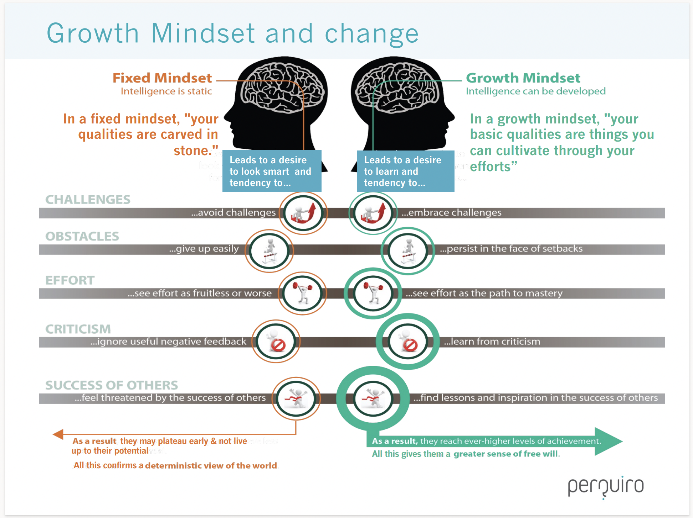

:::::::::::::::::::::::::::::::::::::: questions 

- What is a growth mindset?
- How do you practice a growth mindset as a instructor?

::::::::::::::::::::::::::::::::::::::::::::::::

::::::::::::::::::::::::::::::::::::: objectives

- Model a growth mindset in the classroom.
- Provide feedback using the ASK guidelines.
- Accept feedback and critique with grace and thoughtfulness

::::::::::::::::::::::::::::::::::::::::::::::::

::::::::::::::::::::::::::::::::::::: challenge 

## Discussion: Art Project

Imagine that one day, a child draws a picture of a tree. He shows it to his older sister, his mother, and his aunt.

His older sister says, "That's a terrible drawing, you're bad at art."

His mother says, "That drawing is perfect!! You're an amazing artist!"

His aunt says, "This is so good! I love the details around the leaves. I bet it would look beautiful next time if you tried putting some darker shading behind the trunk."

How do you think the child felt after receiving each of these three pieces of feedback?

::::::::::::::::::::::::::::::::::::::::::::::::

## How We View Ourselves Affects How We Learn

The exercise above showed people giving three different types of feedback. The sister gave harsh negative feedback, claiming that the child was categorically bad at art. The mother gave gushing positive feedback, claiming that the child was categorically good at art. The aunt gave some positive feedback, while also gently suggesting ways that the child might improve in the future. 

The child's mother and sister were both demonstrating what psychologist Carol Dweck calls a **fixed mindset**. This is the belief that ability or intelligence is born rather than made. The child's aunt, on the other hand, was demonstrating the belief that ability can be acquired through effort-- a **growth mindset**. Especially when learning something that feels complex or intimidating, a fixed mindset can interfere with motivation and growth in a number of ways, as laid out in this diagram:

It's important for you to try and encourage a growth mindset in your learners, and the best way to do so is to embody a growth mindset yourself. Let's go through a few common challenges instructors encounter and consider how we might bring a growth mindset to them.

::::::::::::::::::::::::::::::::::::: challenge 

## Exercise: Teaching Troubles

How might someone with a fixed mindset respond to each of these common challenges? What about someone with a growth mindset?

- A learner asks you a question you don't know the answer to.
- You're doing a live coding demonstration, and your code throws an error when you didn't expect it to.
- You're helping someone write a few lines of code, but they're a slow typer. It would be faster if you took their computer and did it yourself as they watched.
- A student is feeling frustrated and tells you, "I'm just no good at coding!".

::::::::::::::::::::::::::::::::::::::::::::::::

We'll go into more detail about how to cultivate a growth mindset in the classroom next week. But for now, let's spend a little time cultivating a growth mindset in ourselves by practicing giving and receiving feedback.

## ASK for Feedback: Actionable, Specific, and Kind

There are many metaphors and acronyms designed to help people give good feedback. One of our favorites is called the ASK framework. It recommends that any feedback you provide to someone should be:

- **Actionable**: If you critique someone on something they have no power to change, your feedback has limited power to help them grow. Furthermore, they may wind up feeling demotivated, or even defensive. Stick to the possible.
- **Specific**: "Make it better" is actionable feedback, but it doesn't really help guide someone towards a better product. It's much more helpful to specify where, how, and why you're recommending changes. For example, "I think the narrative is clearer if you switch these two paragraphs", or "on line 76, you're taking the median value of your data, but it would be more appropriate to take the mean".
- **Kind**: Even if you strongly dislike the thing you're critiquing, it's likely that someone spent a lot of time and effort on it. If you have ever had someone absolutely rip apart something meaningful to you, you know how crushing it can be. Think about the words you use. If you're speaking to someone directly, think about your body language and tone. Remember what it felt like the last time someone was gentle with you. There are two sub-strategies that work well to support kind feedback:
  - *Good news first*: Start by talking about the aspects of the work you enjoyed, and acknowledging the effort that went into it. This helps the feedback receiver to feel secure and open to receiving more critical comments.
  - *"I" statements*: When you are, for example, reviewing a paper, sometimes it's tempting to say "this section is confusing." But you don't actually know that for sure! It was confusing to you, but clearly it made sense to the person who wrote it, and maybe it would also make sense to someone else. When you give feedback, instead consider saying "I was confused by this section because..." and continue with actionable, specific feedback. This is both a more true reflection of your critique, and a kinder way of providing comments.
  
## Ask to ASK
There's another reason we love the acronym ASK for feedback: it reminds us that the giving of feedback should always be preceded by a *question*. Usually, someone asks you for feedback, but occasionally it's also appropriate for you to ask someone if they would like your opinion. Ideally, requests to receive or give feedback should also follow the ASK protocol. For example, say "Hey, I made a figure for a paper but I'm not sure if it's easy to understand, could you tell me what story this plot tells you?" instead of "What do you think of this plot?" This will help guide the feedback-giver toward the actual type of advice you're hoping to receive. 

::: instructor
Take a moment here with your co-instructor, where each of you asks for, and receives, ASK feedback.
:::

## Managing Discomfort
Even when feedback is actively solicited and given in the kindest possible way, it can feel terrible to receive. Many of us, especially those of us who grew up with a fixed mindset, often want our first try to be perfect. When someone gives us tips on how to improve, we can feel humiliated, defensive, and demotivated, because we have not lived up to the standard we set for ourselves.

The process of sitting with and moving past the discomfort that comes with feedback is a crucial component of developing a growth mindset. Everyone develops their own strategy to work through this. Here's an example of how one of your instructors does it:

1. For a few minutes, let myself feel whatever I need to. That person just didn't *understand* me! What do *they* know anyway? Oh no, am I *terrible at this*? What if I'm *never* successful?
2. Start to "reality test" those high-emotion thoughts. Do I really think the person who gave me feedback didn't know what they were talking about? Do I really think that I'm bad at this, or am I proud of the effort I put in? Don't I want to learn how to do better? Isn't the only way to be successful to keep trying?
3. When I'm ready, sit back down with the feedback and really think through it. What good points did this person make? What feedback can I respectfully decline? It's usually at this point that I actually start getting excited about incorporating the feedback, because I can see how it will make my work stronger. 
4. Continue incorporating and refining the feedback. At this point I'm usually really happy and grateful that I asked for help. If I can, I'll thank the person who gave me feedback. I might feel kind of silly for how I responded before, but I know that it's a human response that will happen again. I trust myself to handle it appropriately next time it happens.

::::::::::::::::::::::::::::::::::::: challenge 

## Exercise: Giving and Receiving Feedback

Choose something that you’re working on, like:

- A font you’re using in a document
- A plot you made
- Something you’re considering buying.

Using the ASK guidelines, ask the person sitting next to you to give you some feedback about the thing you’ve selected. Then switch and do the same for them.
What feedback was challenging to give or receive?

::::::::::::::::::::::::::::::::::::::::::::::::

How did this exercise make you feel? What was easy? What was surprisingly difficult?

::::::::::::::::::::::::::::::::::::: keypoints 

- A growth mindset helps provide an effective educational environment for you and your learners.
- When giving feedback, we should be Actionable, Specific, and Kind
- Feeling and managing discomfort is a common part of receiving feedback. Managing discomfort will help you accept feedback and grow from it. 

::::::::::::::::::::::::::::::::::::::::::::::::

