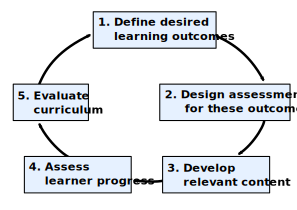

::::::::::::::::::::::::::::::::::::::: objectives

After completing this episode, participants should be able to...

- Explain the lesson design process we will be adopting for this course.
- Summarise the lessons that participants will be working on.

::::::::::::::::::::::::::::::::::::::::::::::::::

:::::::::::::::::::::::::::::::::::::::: questions

- What are the recommended steps to take when developing a new lesson?
- What lesson do you want to develop during and after this workshop?

::::::::::::::::::::::::::::::::::::::::::::::::::

Note: This content was modified from the [Carpentries Collaborative Lesson Development Training][lesson-dev].

:::::::::::::::::::::::::::::::::::::  challenge

## Lesson building 

Let's imagine that tomorrow morning your boss knocks on your door and tells you that she needs you to prepare a data science training for a group of Master's students that will be arriving next month. You know that the students have R installed and know how to run code, but have never worked with data before. You're going to be giving a two-day workshop, five hours each day. 

Also imagine that you can't just go online and teach a ready-made data science course.

How will you begin building out your curriculum?

:::::::::::::::  solution

## Solution

The world of data science is so vast that it's difficult to know where to start. Probably, you started by listing off the topics that you thought were good beginner material, and then putting them in some sort of reasonable order so that you can write a lesson plan for each. 

While this is a strategy that can result in good curricula, here we will be recommending a different way to develop lessons: one that begins with what skills you want the students to have by the **end** of the workshop. From there, you work backwards to determine what the course content should look like.
  
:::::::::::::::::::::::::

::::::::::::::::::::::::::::::::::::::::::::::::::

## A Lesson Design Process

In order to design an effective lesson, we need a structured approach with the learner in mind and  clearly identified goals. Throughout this training, we will use a modified version of Nicholl's five phase paradigm for curriculum design[^1].
Nicholls' paradigm describes a process, commonly referred to as _backward design_,
where those who wish to develop a new curriculum first begin by defining
exactly what their learners will be able to do
_after they have completed the lesson/training/course_.
The subsequent stages of the curriculum design process involve designing content
to directly meet those stated outcomes. The Carpentries developed the modified version of Nicholls' system that we will use in this workshop:

1. Define desired learning outcomes
2. Design assessments to determine progress towards desired outcomes
3. Write content to lead learners from one of these assessments to the next
4. Assess learner progress towards outcomes during teaching
5. Evaluate how closely the outcomes meet the objectives

{
alt="A flow diagram presenting the process of lesson design and development used in this training."
width="67%"
}

Note that the assessment framework here focuses on _formative_, rather than _summative_, assessments. Because of the shorter nature of the course we focus on assessing and modifying progress _while the teaching is still going on_, to give instructors opportunities to evaluate the teaching and lesson content before the end of the workshop. 

We will conduct a small summative assessment in the form of an exit survey that you will complete at the end of the session. This final survey will help us iterate and refine the content as a whole for future trainings.

Note the cyclical nature of the lesson design process:
you will complete one iteration through this cycle during this training.
Note also that _teaching the content_ is an essential intermediate step in the process:
the importance of feedback gathered while teaching the lesson
will be a common refrain throughout this training.

## Your Lesson

This training will provide many opportunities for discussion of your lessons.
Providing some context now for the lessons that you will be creating will
help the Trainers and other participants get involved in those discussions
and give you feedback as you follow the process.

:::::::::::::::::::::::::::::::::::::  discussion

## Group Work: Picking a Lesson Topic

Get together with your project teammate(s). Spend ten minutes deciding what **small** topic you would like to select to teach next week. Remember, it should be on the scale of the following examples:

-   how to make a specific type of plot (line, scatter, bar, etc)
-   how to customize the color scheme of a plot
-   how to convert from one date-time type to another
-   how a single function can help solve a common data cleaning problem

Fill out this short form to let us know who you're working with and what topic you're planning to present.

1. What is the topic of the lesson that you plan to develop based on this training?
2. What is motivating you to create this lesson?

::::::::::::::::::::::::::::::::::::::::::::::::::

:::::::::::::::::::::::::::::::::::::::::::: instructor

## Trainer Note

Where multiple trainees are working on the same lesson project, 
ask for a volunteer or call on someone to represent their team,
leaving space afterwards for their team-mates to speak up if their answers differ.

The main objectives of this discussion are:

- to ensure that the members of each collaborative team share a common vision for the lesson they want to create
- to help Trainers and collaborators understand each trainee's motivation for attending the training and building their lesson

:::::::::::::::::::::::::::::::::::::::::::::::::::::::

## Iterative Development

Over these two weeks, we will be focusing on helping you develop a single short lesson to teach the fundamentals of curriculum design. However, these same skills can be used to build out a much more extensive curriculum (like the one you're learning now). And because so many of the skills you might be teaching are in high demand, it's likely that you may be asked to conduct more trainings than you can possibly have the bandwidth for. Because of this, as you're designing larger courses it may be useful to consider developing a pipeline for tested, shareable curricula that others can pick up and teach. The Carpentries have a lovely model for this type of sharing that we'd like to take a moment to discuss here. 

The Carpentries community develops open source lessons,
which can always be updated and may never be _finished_.
A lesson can undergo many iterations before it reaches a relatively stable state.
To reflect this, we encourage lesson developers to 
indicate the status of their lesson by labelling its progress through a _lesson life cycle_:

{alt="Diagram of the life cycle of a
lesson in The Carpentries ecosystem. A lesson is proposed at the beginning of the
pre-alpha stage. It enters alpha when it is taught for the first time. In beta, it is
taught by other instructors. A full release of the lesson is made when it is stable.
Pilot workshops take place during the alpha and beta phases."}

Each life cycle stage indicates the level of maturity of a lesson:

- **pre-alpha**: a first draft of the lesson is still being constructed.
- **alpha**: the lesson has been/is being taught by the original authors, but has not been fully tested.
- **beta**: the lesson is ready to be taught by instructors who have not been significantly involved in its developed to this point.
- **stable**: the lesson has been extensively tested by the authors and others. It can be considered broadly complete and unlikely to undergo any drastic changes without warning.

Although your lesson will probably remain in pre-alpha throughout this training,
some of the content will be equally valuable at later stages 
and we will also point you towards resources to help with testing the lesson and gathering feedback.

:::::::::::::::::::::::::::::::::::::::: keypoints

- We will learn to develop lessons based on the (slightly adapted) Nicholls' backward lesson design  process.
- There can be many reasons to create a new lesson.
- This training will give you a process to follow to ensure your lesson is effective.

::::::::::::::::::::::::::::::::::::::::::::::::::

[^1]: [Nicholls, G. 2002. _Developing teaching and learning in higher education._ London, UK: Routledge.](https://www.taylorfrancis.com/books/mono/10.4324/9780203469231/developing-teaching-learning-higher-education-gill-nicholls)
